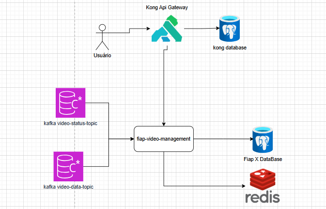

# 🎬 FIAP Video Management

Aplicação responsável por consumir os tópicos `video-status` e `video-data` para atualizar o status e os dados dos vídeos, salvando essas informações no banco de dados para que possam ser consultadas pelos usuários.

Além disso, a aplicação:

- Recebe mensagens do tópico `video-data` e salva no banco para que o usuário possa consultar o status do vídeo e baixá-lo do **S3** posteriormente;
- Possui uma camada de **Redis** para reduzir a carga no banco e controlar o fluxo de mensagens, garantindo que não haja status sendo processados antes do vídeo estar registrado no banco.

---

## 📸 Funcionamento

Fluxo geral:

1. Consome mensagens dos tópicos `video-status` e `video-data`.
2. Atualiza o banco de dados com as informações do vídeo.
3. Utiliza Redis para cache e controle de mensagens.
4. Permite que o usuário consulte o status e faça download do vídeo via S3.

---

## ⚙️ Tecnologias Utilizadas

- **Java 21**
- **Spring Boot**
- **Kafka**
- **Docker** (opcional)
- **Postgres**
- **Redis** (cache e controle de mensagens)
